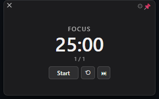
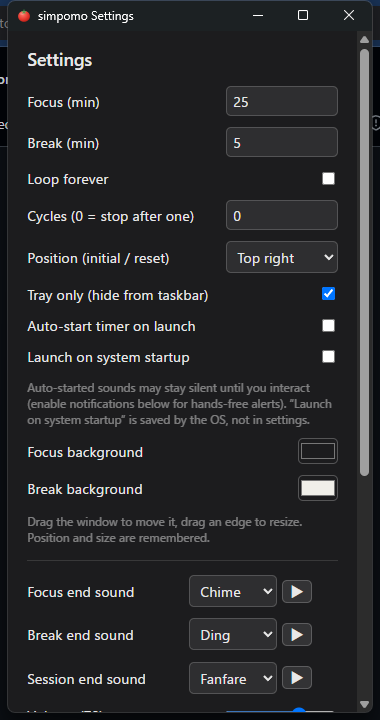

# simpomo

シンプルで軽量なポモドーロタイマーのデスクトップアプリ（Windows / macOS / Linux）。

画面の隅に小さく常駐し、基本は常に最前面。作業に集中したいときだけ、視界の隅でそっと時間を教えてくれます。多機能化せず「邪魔にならず・見やすく・軽い」を最優先にしています。

## ダウンロード

最新版インストーラ → **[GitHub Releases（latest）](https://github.com/gatowostudio/simpomo/releases/latest)**

- **Windows**: `.msi` または `-setup.exe`（`C:\Program Files\simpomo` にインストール）
- **macOS**: `.dmg`（Apple Silicon / Intel）※実機未検証
- **Linux**: `.AppImage` / `.deb` / `.rpm`

> インストーラは未署名のため、初回起動時に警告が出ることがあります（Windows: 「詳細情報」→「実行」、macOS: 右クリック →「開く」）。
> **macOS 版は作者が実機を持たないため未検証**です（Windows / Linux は確認しています）。

ソースからのビルドは [`docs/development.md`](docs/development.md) を参照してください。

## 使い方

起動すると画面の隅に小さなタイマーが出ます。作業→休憩を1セットとして繰り返し、フェーズで背景色が変わるので、音が無くても今が作業中か休憩中か一目で分かります。

| 操作 | 説明 |
|------|------|
| **Start / Pause** | 計測の開始・一時停止 |
| **⟲** | 最初（作業フェーズの先頭）へリセット |
| **⏭** | 現在のフェーズを飛ばして次へ |
| **📌** | 最前面（always-on-top）の ON / OFF |
| **⚙** | 設定を開く |
| **✕** | トレイへ隠す（終了はしない） |
| 端をドラッグ | ウィンドウのリサイズ（中身も拡縮） |
| 本体をドラッグ | 移動（位置・サイズは記憶されます） |
| トレイアイコン | 左クリックで再表示／右クリックメニューで Show・Quit |

### サイクル数（自動継続するセット数）

- **0（既定）**: 作業→休憩を1セット実行したら停止（次は Start を押すまで待機）
- **有限 N**: N セットを自動で連続実行して停止
- **無限（Loop forever）**: 止めるまで自動で継続

## 設定

歯車 ⚙ から開きます。変更は自動保存されます。

- 作業 / 休憩の時間（分）、サイクル数 / 無限ループ
- **表示位置**（初期 / リセット位置）— 隅を選ぶとそこへ移動。以降はドラッグした位置を記憶
- タスクバーに出さずトレイのみ常駐
- **起動時にタイマー自動開始** / **OS スタートアップ登録**（ログイン時に自動起動）
- 作業中 / 休憩中の背景色
- 通知音（作業終了 / 休憩終了 / 完了）と音量 — Web Audio による合成音（同梱ファイルなし）
- フォーカス中の BGM（ホワイト / ピンク / ブラウンノイズ・雨・焚き火）と音量
- トレイに隠している間の **OS トースト通知**（任意・既定 OFF）
- **完了数の統計**（完了したフォーカス / セット数。リセット可）
- 「更新を確認」— GitHub Releases の最新版があるか手動チェック

## 通信について

オフライン完結です。唯一、設定の「更新を確認」を押したときだけ GitHub の Releases API に接続して新しい公開版があるか確認します（その際 IP が GitHub に渡ります）。自動アップデートや常時通信はありません。

## ドキュメント

- 仕様: [`docs/spec.md`](docs/spec.md)
- 技術選定の経緯（なぜ Tauri / Svelte か）: [`docs/decisions/0001-initial-stack.md`](docs/decisions/0001-initial-stack.md)
- 開発・ビルド・リリース手順: [`docs/development.md`](docs/development.md)

## Stack

Tauri v2（Rust）+ Svelte（Vite / TypeScript）
